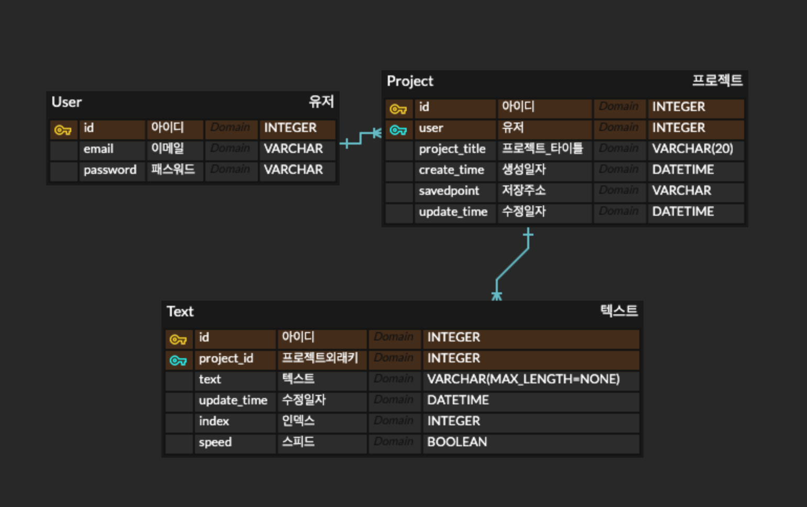
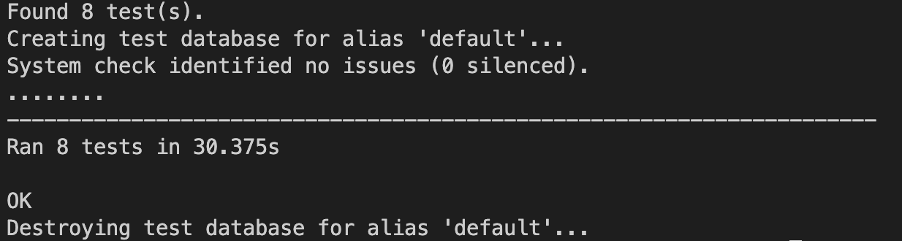

# Text convert  MP3 Service

### Text데이터를 MP3파일로 변경하는 REST API


<br>

## 목차

  * [개발 기간](#개발-기간)
  * [개발 인원](#개발-인원)
  * [프로젝트 개요](#프로젝트-개요)
      - [프로젝트 설명](#01-프로젝트-설명)
      - [개발 조건](#02-개발-조건)
      - [사용 기술](#03-사용-기술)
      - [모델링](#04-모델링)
      - [디렉토리 구조](#05-디렉토리-구조)
      - [API Test](#06-api-test)
  * [프로젝트 분석](#프로젝트-분석)
  * [API ENDPOINT](#api-endpoint)
  * [TIL](#til)


<br>

## 개발 기간
**2022.11.11 ~ 2022.11.15** 

<br>
<br>
  
## 개발 인원
**Back-end  : 김도연**

<br>
<br>


## 프로젝트 개요


<br>

#### 01. 프로젝트 설명

<u>요청받은 Text데이터를 **전처리** 후 Text객체로 생성 후 요청 시 Text객체에 대한 **오디오 파일**을 전송하는 REST API 서비스 </u>
 
<br>
<br>

#### 02. 개발 조건

> <br>
>
> * **데이터**
> 	* 개발에 필요한 기본 데이터 셋 제공
> 	* 주어진 데이터셋이 효과적으로 이용될 수 있게 자유롭게 모델링하여 구현 
>
><br>
>
> * **API**
>
>   *   **프로젝트 생성(오디오 생성)**
>       * 텍스트(str)가 담긴 리스트를 받습니다. (length = 1)  
>       * 이를 전처리하여 오디오를 생성하는 함수의 input으로 같이 넣습니다.
>       [['text1', 'text2', 'text3', ....], path]
>       * 일정시간 이후 함수에서 (id, text)형태의 원소를 가진 리스트를 리턴합니다.
>       [('id1' ,'text1'), ('id2', 'text2'), ('id3', 'text3'), ....]
>       * 오디오는 input의 path에 저장됩니다.
>   
>   *   **텍스트 조회**
>        * 특정 프로젝트의 n번째 페이지를 조회합니다.
>        * 한페이지는 10문장으로 이루어져 있습니다.
>
>   *   **텍스트 수정**
>        * 한 문장의 텍스트와 스피드를 수정합니다.
>
>   
>   *   **오디오파일 송신**
>        * 요청받은 오디오파일을 송신합니다.
>
>   
>   *   **텍스트(오디오) 생성 / 삭제**
>        * 삽입위치는 항상 앞, 뒤가 아닌 중간도 가능.
>
>   
>    * **프로젝트 삭제**
>
> <br>

<br>
<br>


#### 03. 사용 기술 

- **Back-End** : Python, Django, Django REST Framework
- **Database** : MySQL, ERDCloud
- **HTTP**     : Postman
- **ETC**      : Git, Github, Miniconda


<br>
<br>

#### 04. 모델링

<br>


<p align="center"></p>

<br>

- 주어진 데이터를 처리하는 과정을 고려하여 `User(사용자)`, `Project(프로젝트)`, `Text(텍스트)` 3개의 테이블로 모델링

	- `User(사용자)`는 **여러 개**의 `Project(프로젝트)`를 생성할 수 있다..
	- `Project(프로젝트)`에 `User(사용자)`에 대한 외래키를 설정하여 유저에 대한 프로젝트 조회 시 참조
    - 하나의 `Project(프로젝트)`는 **여러 개**의 `Text(텍스트)`를 가지게 된다.
	- `Text(텍스트)`에 `Project(프로젝트)`에 대한 외래키 설정하여 API 요청시 참조

<br>

- `Project(프로젝트)` 테이블에 `savedpoint필드`
    
    - 프로젝트별로 로컬디스크에 저장위치 구분해서 저장

<br>

- `Text(텍스트)` 테이블에 `index필드` `speed필드`
    - index 필드를 이용하여 오디오 생성시 index 순서대로 생성됨
    - text가 한번 생성 후 중간에 추가 삽입 될 시 index를 이용해서 텍스트의 순서 보장
    - gTTS 모듈 사용시 speed 옵션을 위해 boolean 타입으로 저장

<br>
<br>

#### 05. 디렉토리 구조
<br>


```
.
├── __pycache__
├── aipark_service
├── api
    ├── test_text
    ├── utils
├── configs
├── decorators
├── users
    ├── provider
├── exceptions.py
├── manage.py
└── requiremenets.py
 
```


<br>
<br>

#### 06. API Test
<br>


- 유저 관련 회원가입 & 로그인 테스트 코드 작성

- 프로젝트 성공, 조회, 삭제, 업데이트 테스트 코드 작성

<p align="center"></p>


<br>
<br>

## 프로젝트 분석

<br>

- `users`와 `api` 2개의 앱으로 분리
- 데이터 전처리 과정을 위해 `utils.py`에 관련 기능 구현  
<br>

- 회원가입 & 로그인
    - `bcrypt` 모듈을 이용해서 데이터베이스의 패스워드 암호화
    - `jwt` 모듈을 이용해서 인가를 위한 token 발급
    - decorator를 구현해서 인가가 필요한 기능에 추가
<br>
<br>
<br>

- 프로젝트 생성 API 
    - 프로젝트 생성과 텍스트 객체 생성이 따로 분리 되어 있기 때문에 `트랜젝션`을 이용해서 `원자성` 보장 
    - 전처리
        - 입력받은 텍스트를 전처리 함수에서 가공
        - strip()함수를 이용해 문장의 빈 공간 제거
        - 초기 데이터를 개발조건에 맞게 python `re.compile` 활용해 `!`, `.`, `?`를 기준으로 문장을 구분  
        - `re.sub` 활용해 한글, 영어, 숫자, 특정기호를 제외한 데이터 전처리 완료
    
    - 프로젝트 객체 생성
        - 입력받은 `project_title` 와 `savedpoint` 는 우선 빈 칸으로 생성
        - 생성된 project객체를 이용해서 `savedpoint`에 프로젝트 아이디가 포함된 프로젝트별 폴더 생성
        - 텍스트 객체 생성을 위해서 `return project_id`
   
    - 텍스트 객체 생성
        - 앞 서 생성된 프로젝트 객체를 받아서 텍스트 객체 생성
        - 처음 생성시 `enumerate()`를 활용해서 Text객체의 index 추가  
        - 인덱스의 변경을 고려해서 인덱스의 시작 위치 cnt를 함께 받음, 프로젝트 생성시는 default로 cnt=1

    - 오디오 생성
        - `select_related`로 `Text객체`에 정방향 참조로 유저와 project에 대한 text객체인지 확인
        - `os.path.exist()`로 이미 존재하는 해당 프로젝트의 폴더가 있는지 확인, 존재한다면 해당 폴더 삭제 후 다시 생성
        - `gTTS`모듈을 이용해 Text객체별 오디오 파일 생성
<br>
<br>
<br>

- 텍스트 조회 API
    - 요구사항에 10개의 텍스트 파일 출력 제한 조건을 만족하기 위해 `offset`과 `limit` 로 한 페이지에 10개 텍스트 출력
        - `쿼리 파라미터`로 page 결정, page 요청 데이터 없을 시 디폴트로 page=1 
    
    - ModelSerializer로 텍스트 모델 객체를 `역직렬화` 후 반환
        - `many=True` 옵션을 이용해 하나가 아닌 다중 객체에 대한 역직렬화
        - `return safe=False` non-dict objects를 serailizer하기 위해서 옵션 추가
<br>
<br>
<br>

- 텍스트 수정 API
    - `GenericAPIView, UpdateModelMixin` 로 `update`메서드 오버라이딩
    - `partial_update`로 텍스트 객체의 text내용과 speed 수정  
<br>
<br>
<br>

- 오디오 파일 전송 API
    - 요청하는 파일의 프로젝트와 텍스트의 인덱스를 `path 파라미터`로 받음
    - 프로젝트 아이디로 해당 프로젝트의 savedpoint 출력
    - `open(f"{save_point}{index}.mp3", "rb")` 바이너리로 파일을 열어서 해당 인덱스에 해당하는 텍스트 오디오 반환
<br>
<br>
<br>

- 텍스트(오디오)생성/삭제 API
    - 기존에 존재하는 프로젝트의 텍스트에 새로운 텍스트 추가하는 API로 기존의 텍스트의 인덱스 위치 조정이 필요
    - `쿼리 파라미터`로 인덱스값 요청, 인덱스를 기준으로 앞으로 새로운 텍스트 삽입 
        - `filter(index__gte=index)` lookup필드를 이용해서 요청 인덱스보다 큰 인덱스를 가진 텍스트 객체의 인덱스를 위치 변경
        - `make_text_obj()`의 인자로 `cnt`에 인덱스를 값을 넣어줌으로써  `enumerate()`의 시작 값을 인덱스로 변경 
    - `create_text_to_audio()` 기존의 존재하는 폴더 삭제 후 새로운 오디오 파일 생성
<br>
<br>
<br>

- 프로젝트 삭제 API
    - `path 파라미터`로 받은 프로젝트 아이디에 해당하는 프로젝트객체 삭제

</br>

## API ENDPOINT

URL|Method|Description|</br>

### 01.user


|"user/signup"|POST|회원가입|</br>
|"user/login"|POST|로그인&토큰발습|

</br>


### 02.api

#### (1)프로젝트 생성
|"/api/project"|POST| 데이터전처리 & 프로젝트객체 & 텍스트객체 & 오디오파일생성|

</br>

#### (2)텍스트 조회
|"/api/project/<int:project_id>"|GET| page에 대한 default=1로 첫번째 페이지 출력|</br>
|"/api/project/<int:project_id>?page=2"|GET| 2번째 페이지 출력|

- 단 페이지 수 이상의 쿼리파라미터 입력시 `[] 빈 리스트` 출력

</br>

#### (3)텍스트 수정
|"/api/project/<int:project_id>/index/<int:index>'"|PUT| 프로젝트와 인덱스에 해당하는 텍스트파일 수정|

</br>

#### (4)오디오 파일 전송
|"/api/project/<int:project_id>/index/<int:index>'"|GET| 프로젝트와 인덱스에 해당하는 텍스트파일 전송|

</br>

#### (5)텍스트(오디오)생성/삭제
|"/api/project/<int:project_id>"|PATCH| default index=1로 맨 앞에 새로운 텍스트 추가|</br>
|"/api/project/<int:project_id>?index=10"|PATCH| index에 해당하는 위치부토 텍스트 추가|

</br>

#### (6)프로젝트 삭제
|"/api/project/<int:project_id>"|DELETE| project_id에 해당하는 프로젝트 삭제|

</br>


